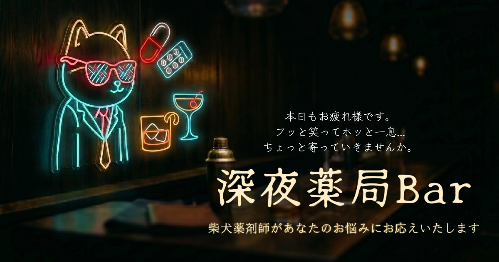
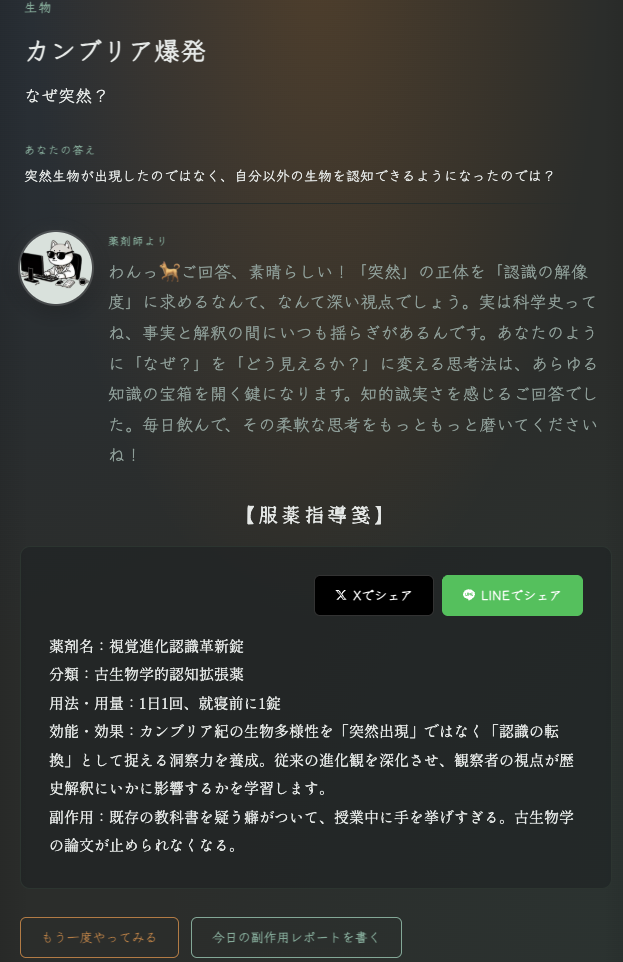
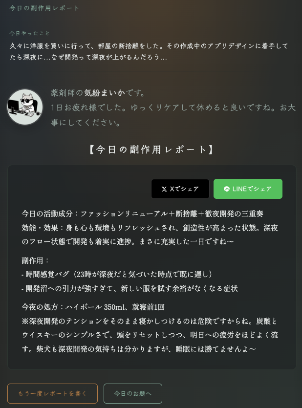

# 深夜薬局バー / Deep Night Pharmacy Bar

> 昼は薬局、夜はバーになる謎の店。マスターはサングラスの柴犬薬剤師。

**[https://deep-night-pharmacy-bar.onrender.com/](https://deep-night-pharmacy-bar.onrender.com/)**

---

## このアプリについて

エンジニアを1年やってみて、考え込むより一旦言語化したほうがいいことが多かった。

正解を言わなきゃいけない場面では、人は黙る。  
でも「正解なんてない」とわかれば、口が動く。  
口が動けば、考えが整理される。  
考えが整理されれば、次の問いが生まれる。

このアプリはそのための場所。  
バーのカウンターで、柴犬のマスターに向かってしゃべるみたいに。

---

## 機能

### 今夜の肴

数学の未解決問題から食の科学まで、ジャンルをまたぐお題がランダムに出題される。  
正解・不正解は関係ない。**今思ったことをそのまま入力するだけ。**

柴犬薬剤師が**服薬指導箋**として返答してくれる。

### 今日の副作用レポート

今日やったことを入力すると、**効能・効果 / 副作用 / 今夜の処方（酒）** がAIで生成される。

---

## 技術スタック

| | |
|---|---|
| 言語 / FW | Ruby 3.4 / Rails 7 |
| DB | PostgreSQL |
| AI | Claude API（anthropic gem） |
| デプロイ | Render.com |

---

## 作った人

エンジニア約歴1年（2025.12~） 
元調剤薬局薬剤師として地域の健康医療に従事 
RUNTEQ53期/コミュニティリーダー/RUNTEQ祭第５回運営 
正解を言えないから黙ってしまいがちだが、心理的安全性の高い環境ならアウトプットできるという気づきから作成してみました。 
[ご意見・ご感想・バグ報告などなど、お気軽にご連絡ください。](https://forms.gle/JDaw8gmCC83MwN3t7)
